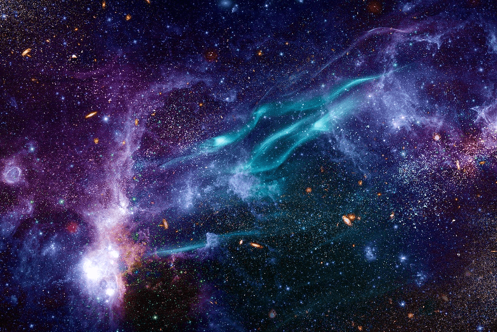

# 🚀 NASA TIMER

Un temporizador web interactivo con temática espacial inspirado en la NASA. Permite configurar horas, minutos y segundos, mostrando una animación especial al finalizar la cuenta regresiva.

---

## 🛠️ Tecnologías Utilizadas

* **HTML5:** Estructura semántica de la aplicación.
* **CSS3:** Diseño personalizado con paleta de colores galáctica, fuentes espaciales (*Orbitron* y *Rajdhani*) y efectos de *Glassmorphism*.
* **JavaScript (ES6):** Lógica del temporizador, manejo de intervalos y actualización dinámica del DOM.

---

## 📋 Características

* **Configuración personalizada:** Ingresa horas, minutos y segundos según tus necesidades.
* **Formato dinámico:** Visualización clara en tiempo real con formato de dos dígitos (`00:00:00`).
* **Efecto al finalizar:** Despliega una animación dinámica de despegue al llegar a cero.
* **Reinicios rápidos:** Botón dedicado para recargar la interfaz en cualquier momento.
* **Diseño Responsive:** Adaptado para visualizarse correctamente en ordenadores y dispositivos móviles.

---

## 🚀 Instalación y Uso Local

No necesitas instalar programas complejos para probar este temporizador:

1. **Descarga el proyecto:** Haz clic en el botón verde **`Code`** arriba a la derecha y selecciona **`Download ZIP`**.
2. **Descomprime el archivo:** Extrae el contenido en cualquier carpeta de tu equipo.
3. **Pruébalo:** Haz doble clic sobre el archivo `index.html` para abrirlo directamente en tu navegador web.

---

> *Si eres desarrollador y prefieres usar la consola, también puedes clonarlo ejecutando:*
> `git clone https://github.com/AngelTDeveloper/Nasa---Timer.git`